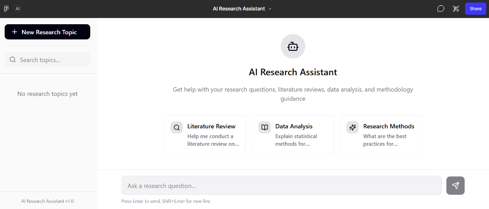
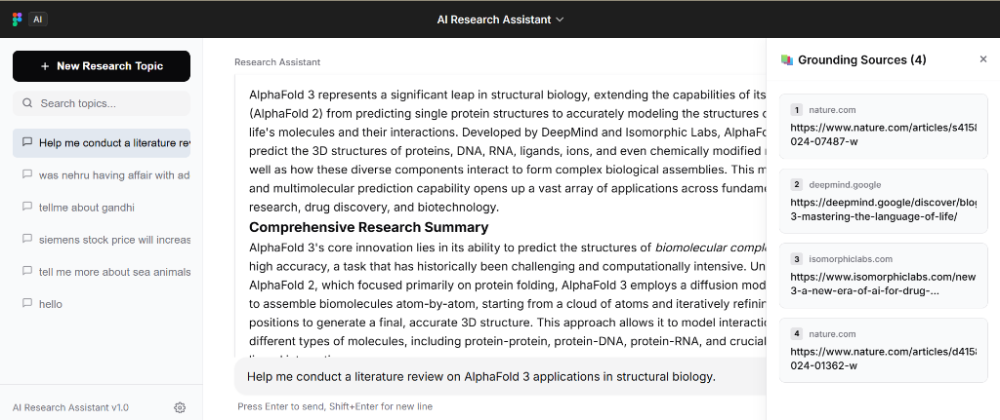
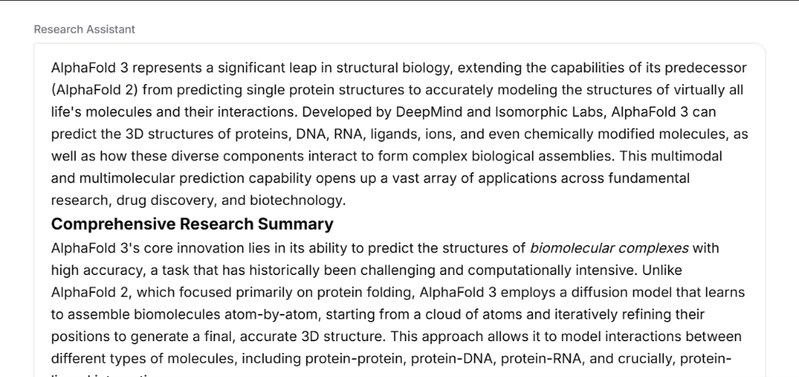

# AI Research Assistant: Autonomous RAG & Multi-Agent Co-Pilot

> An enterprise-grade, high-performance RAG pipeline and multi-agent system designed to automate academic synthesis, facts validation, and citation parsing, powered by **Google Gemini 2.5 Flash** and featuring a clean, Figma-inspired web dashboard.

---

## Screenshots




---

## System Architecture

The project features a **two-stage retrieval pipeline** integrated with a **multi-agent orchestration team** powered by Gemini 2.5 Flash.

```
+-------------------------------------------------------------+
|                     USER INTERFACE LAYER                    |
|                FastAPI Backend / Web UI Dashboard           |
+------------------------------+------------------------------+
                               |
            ┌──────────────────┴──────────────────┐
            ▼ (Ingestion Path)                    ▼ (Query Path)
+------------------------------+  +---------------------------+
|      INGESTION PIPELINE      |  |      RETRIEVAL LAYER      |
|  - URL Loader (BS4)          |  |  - Query Embedder         |
|  - PDF Loader (PyMuPDF)      |  |  - Pinecone Search (k=8)  |
|  - Token Chunker (512/50)    |  |  - MiniLM Reranking (k=3) |
|  - Pinecone Serverless       |  +-------------+-------------+
+------------------------------+                |
                                                ▼ (Context Chunks)
+-------------------------------------------------------------+
|                  AGENT ORCHESTRATION LAYER                  |
|          LangChain ReAct / CrewAI Sequential Flow           |
|                                                             |
|   +-----------------------+     +-----------------------+   |
|   |     ResearchAgent     | --> |   FactCheckerAgent    |   |
|   |  (Gemini 2.5 Flash)   |     |  (Gemini 2.5 Flash)   |   |
|   +-----------+-----------+     +-----------+-----------+   |
|               |                             |               |
|               ▼ (Web/KB Tools)              ▼               |
|   +-----------+-----------+     +-----------+-----------+   |
|   |      Tool Layer       |     |     CitationAgent     |   |
|   |  - Web Search (Tavily)|     |  (Gemini 2.5 Flash)   |   |
|   +-----------------------+     +-----------+-----------+   |
|                                             |               |
|                                             ▼               |
|   +-----------------------------------------------------+   |
|   |                    Output Layer                     |   |
|   |     Structured JSON with Citations & Confidence     |   |
|   +-----------------------------------------------------+   |
+-------------------------------------------------------------+
```

---

## Key Features

1. **Google Gemini LLM Backbone**: Uses **Gemini 2.5 Flash** for reasoning, synthesis, citation formatting, and multi-agent coordination.
2. **Figma-Inspired Web UI**: High-fidelity, clean layout styling matching Figma design guidelines, with sidebar topic history, real-time response streaming, and interactive collapsible sources/citations drawer.
3. **Advanced Retrieval System**: 
   - Core embedding using Sentence-Transformers (`all-MiniLM-L6-v2`).
   - Pinecone serverless integration for indexing and vector similarity search.
   - Cross-encoder reranking (using `cross-encoder/ms-marco-MiniLM-L-6-v2`) to prioritize the top 3 most relevant source text blocks.
4. **Resilient Architecture for Windows**: Special preemptive import structure resolving the binary DLL access violations (`0xC0000005`) that typically crash PyTorch/sentence_transformers when imported alongside Pinecone/PyMuPDF on Windows platforms.

---

## Directory Structure

```
.
├── README.md                # System documentation (Root level)
└── research_assistant/      # Application source directory
    ├── app/
    │   ├── __init__.py      # Preemptive sentence_transformers setup for Windows
    │   ├── main.py          # FastAPI server entry point
    │   ├── api/
    │   │   ├── routes.py    # API endpoints (ingest URL, ingest PDF, research query)
    │   │   └── schemas.py   # Pydantic request/response models
    │   ├── core/
    │   │   ├── agent.py     # ResearchReActAgent using Gemini 2.5 Flash
    │   │   ├── crew.py      # CrewAI agents (Researcher, Fact Checker, Citation Specialist)
    │   │   ├── ingestion.py # Crawling (BeautifulSoup) and loading (PyMuPDF)
    │   │   └── retrieval.py # Pinecone vector querying & MiniLM reranking
    │   ├── tools/
    │   │   ├── citation.py  # Regex parser for inline bracket citations and confidence estimator
    │   │   └── web_search.py# Tavily API web search tool wrapper
    │   └── utils/
    │       ├── embeddings.py# MiniLM embeddings layer helper
    │       └── chunker.py   # Clean whitespace chunker
    ├── tests/
    │   ├── conftest.py      # Pytest hooks for early imports on Windows
    │   ├── test_agent.py    # Unit tests for ReAct agents & citation formatting
    │   ├── test_ingestion.py# Unit tests for scrapers & chunkers
    │   └── test_retrieval.py# Unit tests for vector indexing & reranking
    ├── notebooks/
    │   └── demo.ipynb       # Interactive pipeline demonstration
    ├── index.html           # Premium Web UI Dashboard
    ├── test_runner.py       # Safe command-line test runner
    ├── requirements.txt     # Project dependencies
    ├── .env.example         # Template for API keys
    └── Dockerfile           # Deployment container definition
```

---

## Configuration Reference

Create a `.env` file in the `research_assistant` directory using the `research_assistant/.env.example` template:

```env
# Core LLM Key
GOOGLE_API_KEY=your_gemini_api_key_here

# Vector Database Configuration
PINECONE_API_KEY=your_pinecone_api_key_here
PINECONE_INDEX_NAME=research-assistant

# Web Search API Configuration
TAVILY_API_KEY=your_tavily_api_key_here

# Server Settings
PORT=8000
HOST=0.0.0.0
LOG_LEVEL=info
```

---

## Quick Start Guide

### 1. Local Setup
```bash
# Navigate to the research_assistant folder
cd research_assistant

# Create virtual environment
python -m venv venv
source venv/bin/activate  # On Windows: venv\Scripts\activate

# Install requirements
pip install -r requirements.txt
```

### 2. Start the Backend Server
```bash
python -m app.main
```
The FastAPI backend will start at `http://127.0.0.1:8000`. You can explore the interactive OpenAPI docs at `http://127.0.0.1:8000/docs`.

### 3. Launch the Web UI
Since the user interface is self-contained in a premium `index.html` file inside the `research_assistant` directory:
* **Option A**: Double-click `research_assistant/index.html` to open it directly in any modern browser.
* **Option B**: Use any static web server:
  ```bash
  cd research_assistant
  python -m http.server 3000
  ```

Configure your Gemini API key in the UI settings panel. The key is securely preserved in your browser's local storage and used directly for real-time streaming connections.

### 4. Running the Tests
To run all verification suites safely:
```bash
cd research_assistant
python -m pytest
```

---

## API Reference

### 1. Ingest URL
* **Endpoint**: `POST /api/v1/ingest/url`
* **Request Body**:
```json
{
  "url": "https://nature.com/articles/s41586-024-07487-w"
}
```

### 2. Ingest PDF Document
* **Endpoint**: `POST /api/v1/ingest/pdf`
* **Multipart Form**: `file` (binary PDF file payload)

### 3. Submit Research Query
* **Endpoint**: `POST /api/v1/query`
* **Request Body**:
```json
{
  "query": "What are the latest breakthroughs in protein folding prediction and how do they compare to AlphaFold2?",
  "use_crew": false
}
```

---

## Windows DLL Conflict Note
When loading deep learning frameworks (like PyTorch and `sentence_transformers`) alongside native C-binding wrappers (like PyMuPDF `fitz` or Pinecone), Windows systems can raise an Access Violation `0xC0000005` DLL crash if imports are resolved in the wrong order. 
This project resolves this by preemptively importing `sentence_transformers` at the very entry points of execution:
- `research_assistant/app/__init__.py` for main execution paths.
- `research_assistant/tests/conftest.py` for testing suites.
- `research_assistant/run_pipeline.py` for the standalone pipeline script.

---

## License

Distributed under the MIT License. See `LICENSE` for details.
